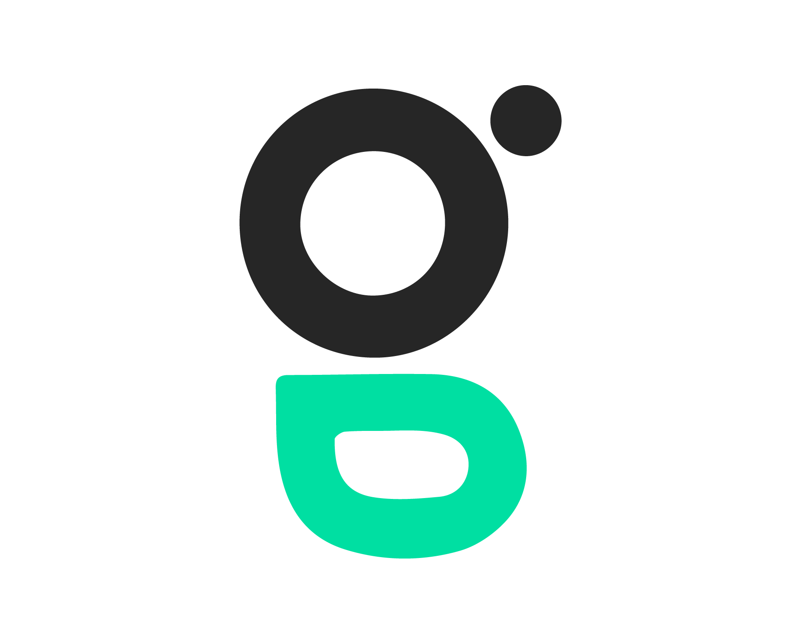

<h1 align="center" style="display:flex; align-items: center; justify-content: center">
    
    
</h1>


<h4 align="center" style="margin-bottom: 20px">
  GraphQL - Frontend Client
</h4>

<div align="center">
  
  
  
</div>

<p align="center" style="width: 100%; display: flex; flex-direction: row; justify-content: center; margin: 20px 0;">
  <a href="#rocket-techs" style="margin: 0 10px">Description</a> |
  <a href="#notebook-running"style="margin: 0 10px">Running</a> |
  <a href="#notebook-running"style="margin: 0 10px">Documentation</a>|
</p>
<br>

## :book: Description
Sup, there! I created this simple ReactJS project where you can see the branches and understand how to use GraphQL and Apollo Client. You MUST have an GraphQL Server running, I also created a repository with a simple backend structure. 

- [GraphQL Server](https://github.com/glauberbrack/apollo-graphql)
---
Querys and Mutations Examples
- [Simple Query](https://github.com/glauberbrack/graphql-apollo-frontend/commit/12214dcab75aa3d52fefade24dbdac792a4d155a)
- [Simple Mutation](https://github.com/glauberbrack/graphql-apollo-frontend/commit/e7f5be7748bd7cecdcd1c27c8a72eaa39796f5e6)
- [useQuery](https://github.com/glauberbrack/graphql-apollo-frontend/commit/d400d75536b03b50275fa1cb5aae11a4766bd08d)
- [useMutation](https://github.com/glauberbrack/graphql-apollo-frontend/commit/c05d8fb821760ae2acb3e2ec17826bc8821cdea9)

## :notebook: Running

```bash
# Clone the project
$ git clone https://github.com/glauberbrack/graphql-apollo-frontend

# Go to the folder
$ cd graphql-apollo-frontend

# Install all the depencies
$ yarn install

# Run the project
$ yarn start
```

## 📁 Documentation
I also wrote a full documentation and explanation of the Server and Client on Notion. Enjoy it!

[PORTUGUESE 🇧🇷](https://www.notion.so/glauberbrack/GraphQL-b06c546db2af415594a22ac8e574e37f)

## 🤓 Found Me
LinkedIn: https://www.linkedin.com/in/glauber-brack/

---
